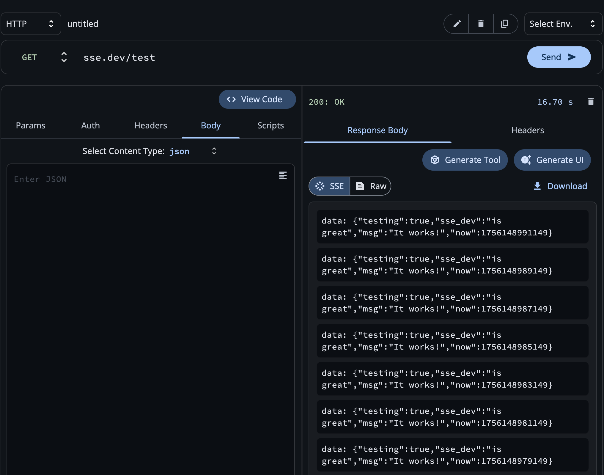
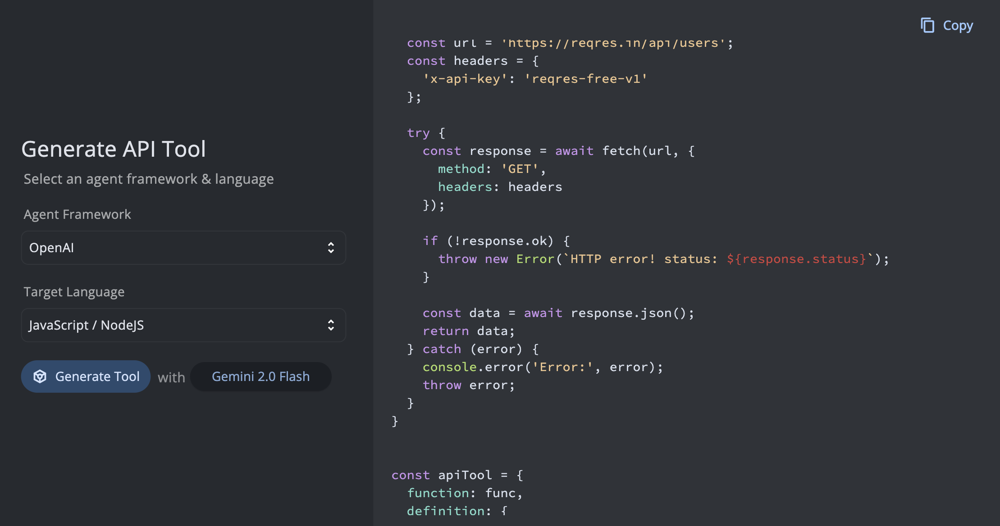

# GSoC'25 - AI-Based API Response to Dynamic UI and Tool Generator

> Final report summarizing my contributions to the project as part of GSoC'25

## Project Details
1. **Contributor** : Manas M Hejmadi
2. **Mentors** : Ashita P, Ankit M, Ragul Raj M
3. **Organization**: API Dash
4. **Project**: AI-Based API Response to Dynamic UI and Tool Generator

#### Quick Links
- [GSoC Project Page](https://summerofcode.withgoogle.com/myprojects/details/hhUUM8wl)
- [Code Repository](https://github.com/foss42/apidash)
- [Discussion Logs](https://github.com/foss42/apidash/discussions/852)

## Project Description

The primary objective of this project was to extend the ApiDash client with new generative AI capabilities that go far beyond the scope of traditional API testing clients. This will position apidash as an OpenSource AI-Native API Testing client.

Our initial vision was to develop an AI-powered agent capable of transforming raw API responses into structured UI schemas and fully functional UI components that could be directly exported and used in frontend applications. Additionally, we wanted to enable dynamic customization of UI components through natural language prompts, allowing developers to customise the design and layout according to their personal preference. This UI code could then be exported and used directly in their Flutter projects. 

As mentioned in the project proposal, we were also aiming to create a one-click `API Request to Tool` generation pipeline, allowing external AI agents to independently interact with APIs. This is a crucial requirement for modern agentic workflows and the idea was that apidash must be ready to serve these needs.

However, during the planning phase it became clear that these ambitious features required strong foundational infrastructure to work at a production level. Under the guidance of my mentors, we identified and implemented several core architectural improvements, such as:

- Refactoring the networking layer into a modular, standalone package to enhance testability and maintainability.
- Adding streaming support via Server-Sent Events (SSE) to enable real-time AI interactions.
- Introducing AI request handling and a dedicated AI primitives package. This ensures that any future apidash feature that would need generative ai, can directly import this primitives package instead of implementing everything again. this saves both time and effort.

All in all, these completion of these improvements will establish apidash as a modern, industry ready platform for developers and AI-driven workflows alike.


## Feature Description

###  `better_networking` package creation & project-wide refactor

`Package Link`: https://pub.dev/packages/better_networking

`Associated Pull Request`: [#857](https://github.com/foss42/apidash/pull/857)

Initially, the entire networking constructs that apidash relied on was fully written inside a module named `apidash_core`. 
The networking code was fairly advanced including support for GraphQL, request cancellations and a lot of other good features. Howeever, as it was tightly coupled with apidash, we were unable to allow the rest of the flutter developer community to use these features.
At apidash, we believe in giving back to the open source community and hence the mentors and I decided to refactor everything into a new package. 
During discussions, I came up with the name `better_networking`. We envisioned it to  be the go-to package for everything related to networking for a flutter application.

This proved to be a great decision, as we were able to separate it completely, publish it on [pub.dev](https://pub.dev/packages/better_networking), and achieve over 95% code coverage through isolated testing.

This is an example of how better_networking simplifies request handling


```dart
final model = HttpRequestModel(
  url: 'https://api.example.com/data',
  method: HTTPVerb.post,
  headers: [
    NameValueModel(name: 'Authorization', value: 'Bearer <token>'),
  ],
  body: '{"key": "value"}',
);

//Sending HTTP Requests
final (resp, duration, err) = await sendHttpRequest(
  'unique-request-id',
  APIType.rest,
  model,
);

// To cancel the request
cancelHttpRequest('unique-request-id');
```


---

### Added SSE and Streaming Support to the Client
`Associated Pull Request`: [#861](https://github.com/foss42/apidash/pull/861)


SSE Support was a long pending [issue](https://github.com/foss42/apidash/issues/116) (since 2024) and hence the mentors asked me to see if i was able to implement SSE support into `better_networking` and simultaneously into `apidash` itself. The implementations suggested by other contributors in the past involved creation of SSE as a completely new request type.
However, I did not agree with this approach as SSE is not a fundamentally separate request type like GraphQL. Hence, I wrote up a quick demo with SSE implemented within the existing apidash foundation code. The mentors were impressed with this approach as it was far more maintainable and sensible than creating new models for it.

Rewrote the original implementation of `sendHttpRequest` in terms of this new SSE handler
```dart
Future<(HttpResponse?, Duration?, String?)> sendHttpRequest(
  String requestId,
  APIType apiType,
  HttpRequestModel requestModel, {
  SupportedUriSchemes defaultUriScheme = kDefaultUriScheme,
  bool noSSL = false,
}) async {
  final stream = await streamHttpRequest(
    requestId,
    apiType,
    requestModel,
    defaultUriScheme: defaultUriScheme,
    noSSL: noSSL,
  );
  final output = await stream.first;
  return (output?.$2, output?.$3, output?.$4);
}
```
This way, everything stays unified and we reduce the amount of duplication
 
---

### Added Agents and AI Requests Support

`Associated Pull Request`: [#870](https://github.com/foss42/apidash/pull/870)

With the rapid rise of Generative AI, it became clear that API Dash required a dedicated AI request interface with support for agentic systems. Based on this need, my mentors tasked me with developing a comprehensive AI Requests feature, along with an integrated agent building framework for future agentic integrations within the apidash application


The new AI Requests feature supports key capabilities such as remote model import and selection, multi-provider integration, along with support for streaming responses.


The newly created genai package enables users to build their own agents with features like prompt templating and more, making it simple and efficient to create powerful in-app agents.


#### Sample Agent Code

```dart
//simple_func_agent.dart

class SimpleFuncGenerator extends APIDashAIAgent {
  @override
  String get agentName => 'SIMPLE_FUNCGEN';

  @override
  String getSystemPrompt() {
    return """You are a function generator.
Given API details (REQDATA) and a programming language (TARGET_LANGUAGE),
create a method named `func` that performs the API call.
Return only the code.
""";
  }

  @override
  Future<bool> validator(String aiResponse) async {
    return aiResponse.contains("func");
  }

  @override
  Future outputFormatter(String validatedResponse) async {
    validatedResponse = validatedResponse
        .replaceAll(RegExp(r'```[a-zA-Z]*\n?'), '')
        .replaceAll('```', '');
    return {
      'FUNC': validatedResponse,
    };
  }
}

```
---

### Created the API Tool Generator
As mentioned in my original GSoC proposal, i wanted to use the newly created agentic architecture provided by `genai` package to build an API Tool Generator. 
The in-app agent takes the API request details and converts it into standard tool call code from multiple providers such as `openai`, `gemini`, `langchain` and so on



---

### Implemented the API Schema to Flutter UI Generator

The Proof of Concept (PoC) for this was already shown during the initial GSoC period. Once the agentic infrastructure had been developed under `genai` package. All that was left to do was to convert the PoC into production ready code along with handling all the errors. 


we could convert the above API response into a Flutter UI that looks something like this and then export the code. We are free to make any natural language modifications if necessary too.


This makes use of the Server Driven UI Concept powered by [Stac](https://stac.dev/)

---

## Complete Pull Request Report


| Feature | PR | Issue | Status | Comments |
|---|---|---|---|---|
|Proof of Concept & Proposal Doc|[#755](https://github.com/foss42/apidash/pull/755)||Merged||
|FIX: `<optimized out>` exception|[#780](https://github.com/foss42/apidash/pull/780)|[#782](https://github.com/foss42/apidash/issues/782)|Merged||
|AI Requests Feature Initial Implementation|[#850](https://github.com/foss42/apidash/pull/850)||Closed|multiple modifications suggested|
|AI Requests Feature Fine tuning|[#856](https://github.com/foss42/apidash/pull/856)||Closed|SSE and Separate Networking layer was deemed necessary before this PR|
|`better_networking` Package Creation|[#857](https://github.com/foss42/apidash/pull/857)||Merged|
`genai` package foundations|[#859](https://github.com/foss42/apidash/pull/859)||Closed|Mentor requested for a new PR after making some changes|
|SSE Feature Foundations|[#860](https://github.com/foss42/apidash/pull/860)||Closed|Mentor requested changes and rebase to main branch|
|SSE & Streaming Support|[#861](https://github.com/foss42/apidash/pull/861)|[#116](https://github.com/foss42/apidash/issues/116)|Merged||
|`genai` & AI Requests Feature|[#870](https://github.com/foss42/apidash/pull/870)|[#871](https://github.com/foss42/apidash/issues/871)|Open|Under Review
|AI UI Designer & Tool Generator|[#874](https://github.com/foss42/apidash/pull/874)|[#617](https://github.com/foss42/apidash/issues/617)|Open|Under Review
|Final Report Documentation|[#878](https://github.com/foss42/apidash/pull/878)||Open|Under Review
---


## Challenges Faced

talk about new learnign and overcoming issues

- SDUI Dilemma (cannot use hosted rendering server, cannot use Reflection, cannot bundle flutter sdk), hence had to rely on Server Driven UI using Stac
- Stac has no support for returning errors
- Larger UIs tend to generate too long Stac code which gets clipped and leads to faulty output
- Since we cannot fine tune or use external models (for data safety), we have to rely solely on Good System prompting to get the Stac code right. This is by far the biggest challenge and that is why we have restricted ourselves to a small subset of Stac widgets. We will expand on this in the future


## Future Work
- Expand on the available Stac SDUI Widgets so that more detailed UIs can be generated from API complex responses
- Integration tests for AI Requests Feature and the ToolGen, UIGen Features


## Design and Prototypes Link
- [API Tool Generation Research Document ](https://docs.google.com/document/d/17wjzrJcE-HlSy3i3UdgQUEneCXXEKb-XNNiHSp-ECVg)
- [AI UI Designer prototype](https://github.com/synapsecode/AI_UI_designer_prototype)
- [FlutRun (My custom remote flutter component rendering service)](https://github.com/synapsecode/FlutRun)

## Conclusion
Google Summer of Code 2025 with apidash has been a truly amazing experience. My work throughout this project centered on building the core infrastructure that will be the heart of apidash's next-gen features, and I believe I have successfully laid a strong foundation. I look forward to seeing future contributors build upon it and take the project even further.