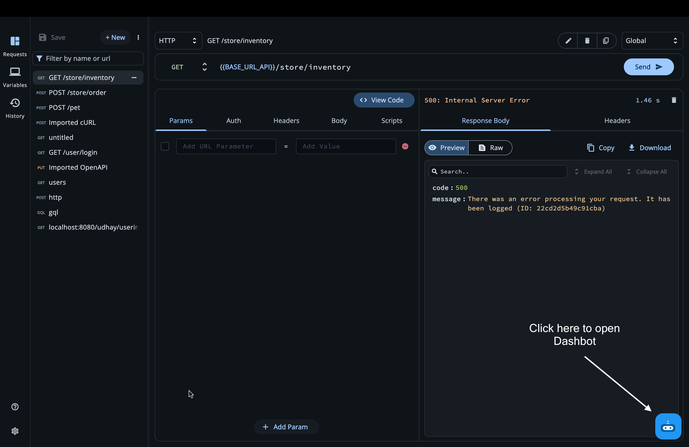
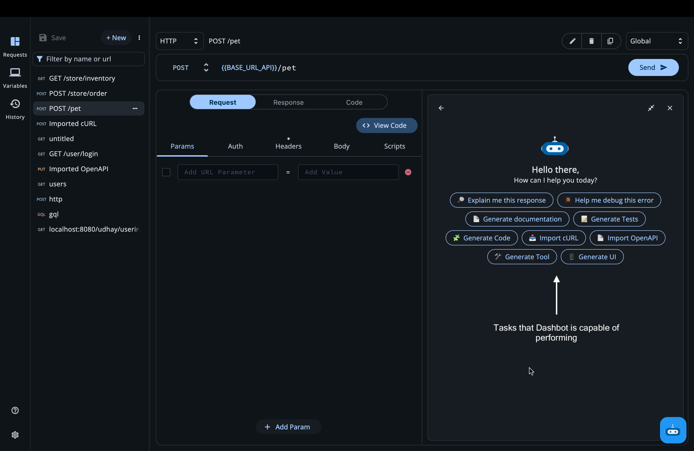
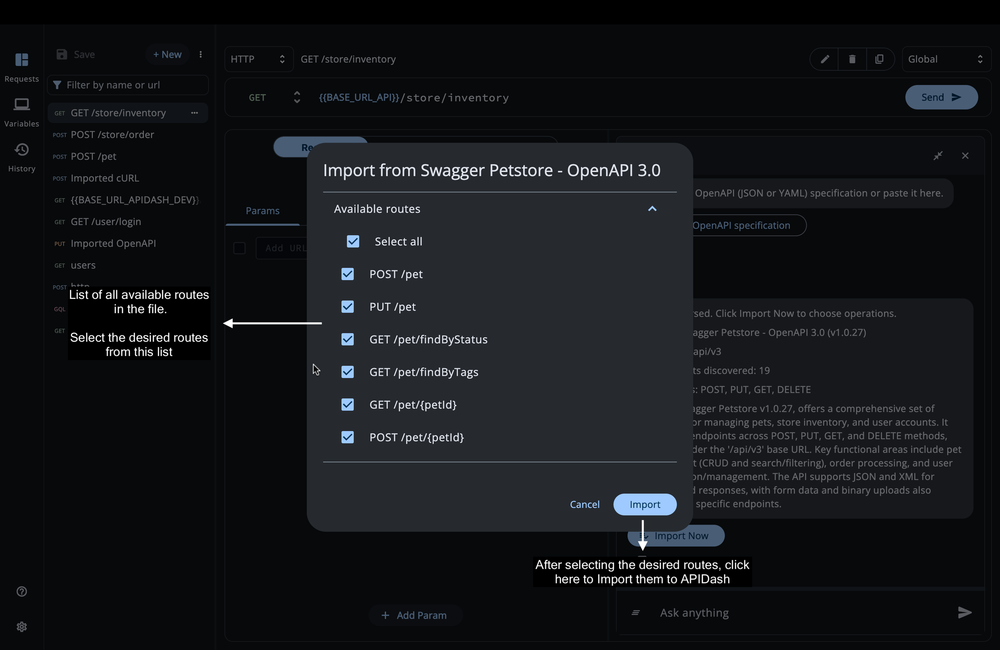
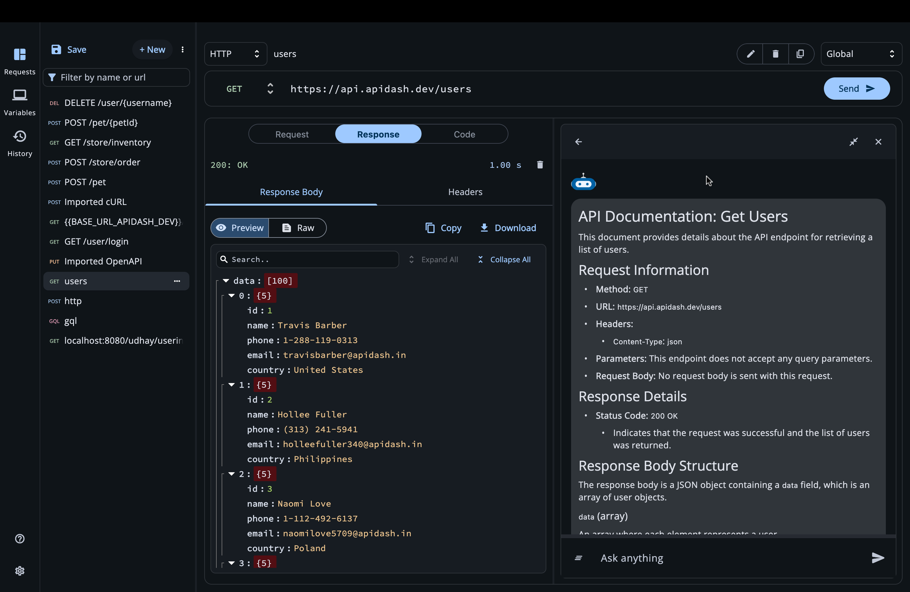
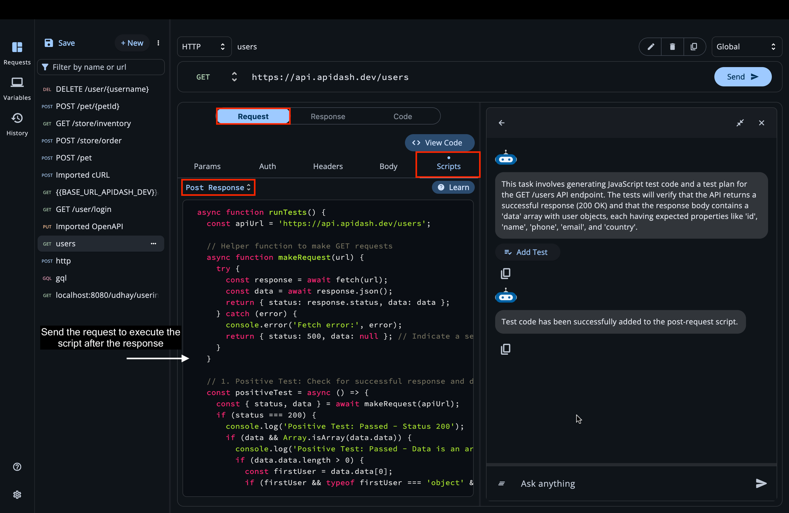
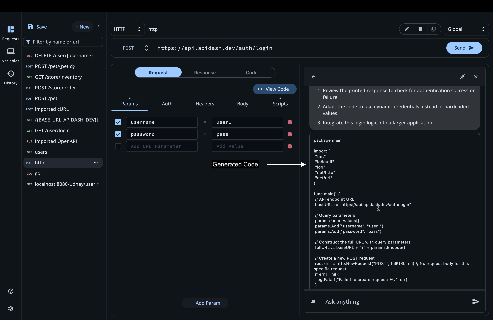
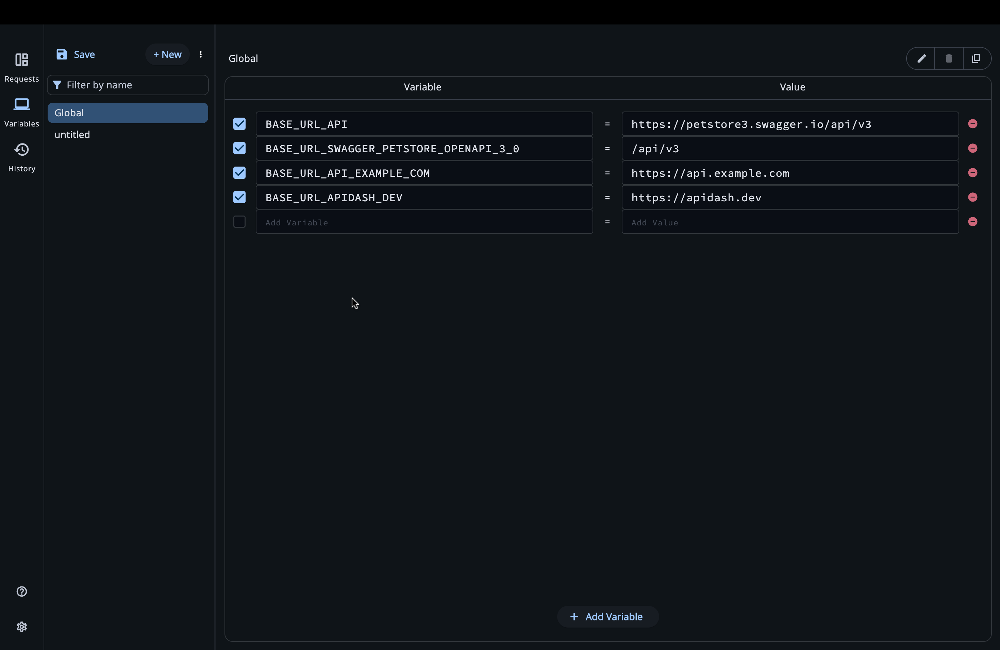

# Dashbot User Guide

Dashbot is your in-app helper for working with APIs inside API Dash. It explains responses, helps fix failing requests, imports cURL/OpenAPI, generates documentation, tests, and runnable code — all without leaving your current request.


## Before You Start
- **Configure an AI model** : Open the AI Request settings and set your preferred provider/model and API key. Dashbot needs this to generate answers. If not configured, you will see a message asking you to set it up.
- **Pick or create a request** : Dashbot works best when a request is selected, especially for Explain, Debug, Tests, Docs, and Code.
- **Network access** : Some features pull insights only from your current request and input. No external API calls are made by Dashbot itself (outside your configured AI provider).

## Open Dashbot
- Floating window: Click the Dashbot button to open it as a floating panel.
  - **Move**: Drag the colored top bar to reposition.
  - **Resize**: Drag the small handle at the top-left corner.
  - **Pop in/out**: Use the “open in new” icon to toggle between the floating window and the in-tab view.
  - **Close**: Click the Close icon. You can reopen anytime.
- In a tab: Use the Dashbot tab for a docked experience with back and close controls.




## Home Screen Tasks
Dashbot’s home screen lists quick actions:
- **Explain response**: Explains the last response for the selected request.
- **Debug error**: Analyzes a failing response and proposes minimal fixes.
- **Generate documentation**: Creates clean Markdown docs for your request/response and lets you download them.
- **Generate tests**: Builds simple JavaScript tests; you can add them to the request’s post-request script.
- **Generate code**: Produces runnable code in common languages.
- **Import cURL**: Paste a full cURL to recreate a request.
- **Import OpenAPI**: Upload, paste, or fetch (URL) a spec and import endpoints.



---

## Import cURL
Turn a cURL command into an API Dash request without manual setup.

How it works
1) Choose “Import cURL”.
2) Paste a complete command starting with `curl ...`.
3) Dashbot parses the command and shows:
   - A short summary (method, URL, headers, body type)
   - A diff preview vs your currently selected request (if any)
   - Action buttons:
     - Apply to Selected: Update the currently selected request.
     - Create New Request: Add a new request to your collection.
4) Click an action to apply.

Base URL as environment
- Dashbot detects the base URL and may rewrite your request URL as `{{BASE_URL_<HOST>}}/path`.
- It will create or update a variable in your active Environment (for example `BASE_URL_API_EXAMPLE_COM`).
- See Environment guide for details on editing values.

What’s included from cURL
- Method, full URL
- Headers (including Cookie, User-Agent, Referer; Basic auth from `-u user:pass`)
- Body or form data when present

Known limits
- Some flags do not map to requests (e.g., `-k` insecure SSL, `-L` follow redirects, or very advanced curl options). Review and adjust after import if needed.
- If parsing fails, ensure the command is complete and starts with `curl`.


### Example: Try It Yourself

Let's walk through importing a real cURL command that you can test right now.

**What we're importing:**
A form data request to the API Dash demo endpoint that takes text input and repeats it with a separator.

**Expected response:**
The API will return `{"data": "Hello_World_Hello_World_Hello_World"}` - your text repeated 3 times with underscores as separators.

**Follow these steps:**

1. **Copy this cURL command:**
   ```bash
   curl -X POST "https://api.apidash.dev/io/form" \
     -H "Accept: application/json" \
     -H "Content-Type: application/x-www-form-urlencoded" \
     -d "text=Hello%20World" \
     -d "sep=_" \
     -d "times=3"
   ```

2. **Open Dashbot** by clicking the floating Dashbot button in API Dash.

<p align="center">
  
  <br>
  <em>Dashbot Home Screen with Import cURL Task</em>
</p>

3. **Choose "Import cURL"** from the home screen tasks.

<p align="center">
  
  <br>
  <em>Import cURL Interface Ready for Input</em>
</p>

4. **Paste the cURL command** into the text area and press Enter/Return or click the send button.

<p align="center">
  
  <br>
  <em>cURL Command Pasted into Dashbot Chat</em>
</p>

5. **Review the parsed result:**
   - Method: `POST`
   - URL: `https://api.apidash.dev/io/form`
   - Headers: `Accept: application/json`, `Content-Type: application/x-www-form-urlencoded`
   - Body: Form data with `text`, `sep`, and `times` parameters

<p align="center">
  
  <br>
  <em>Dashbot Parsed Result with Apply Actions</em>
</p>

6. **Apply the import:**
   - Click **"Create New Request"** to add it as a new request in your collection
   - Or click **"Apply to Selected"** if you want to update an existing request

7. **Test the request:**
   - Send the imported request
   - You should receive a `200 OK` response with the body: `{"data": "Hello_World_Hello_World_Hello_World"}`

**View the imported request details:**

<p align="center">
  
  <br>
  <em>Imported Request Headers</em>
</p>

<p align="center">
  
  <br>
  <em>Imported Request Body with Form Data</em>
</p>

<p align="center">
  
  <br>
  <em>API Response with 200 OK status</em>
</p>

8. **Notice the environment variable:**
   - Dashbot automatically created `{{BASE_URL_API_APIDASH_DEV}}` in your active environment
   - The request URL becomes `{{BASE_URL_API_APIDASH_DEV}}/io/form`
   - You can edit this variable in your Environment settings if needed

<p align="center">
  
  <br>
  <em>Auto-created Environment Variable</em>
</p>


---

## Import OpenAPI
Import endpoints from an OpenAPI (Swagger) spec to quickly scaffold requests.

Supported input
- JSON or YAML OpenAPI files.
- Public URL to a JSON or YAML OpenAPI document (e.g., `https://api.apidash.dev/openapi.json`).
- Upload via the “Upload Attachment” button (file picker), paste the full spec into the chat box, or enter a URL in the chat field and fetch.

Workflow
1) Choose “Import OpenAPI”.
2) Provide the spec by uploading, pasting, or entering a URL then clicking Fetch.
3) If valid, Dashbot shows a summary plus an “Import Now” button.
4) Click “Import Now” to open the Operation Picker.
5) In the picker:
  - Select All or cherry-pick operations (multi-select).
  - Click Import to add them as new requests.
6) New requests are named like `GET /users`, `POST /items`, etc.

Base URL as environment
- If the spec defines servers, Dashbot will infer the base URL and may rewrite imported URLs to use an environment variable like `{{BASE_URL_<HOST>}}`.

URL fetching notes
- The URL must be publicly reachable and return raw JSON or YAML (not an HTML page).
- Auth-protected or dynamically generated docs pages may fail; download and upload the spec instead.
- Large remote specs may take longer; try file upload if a timeout occurs.

Notes and limits
- Very large specs may take longer and could show only the first N routes for performance.
- Some request body examples or schema-derived form fields may not auto-populate if missing explicit examples.
- “Apply to Selected” is supported when importing a single operation via certain actions, but the Operation Picker’s “Import” creates new requests.
- If URL import fails, verify the URL returns the spec directly and that no authentication is required.




---

## Explain Response
Get a clear, friendly explanation for the selected request.

Use when
- You received a status like 2xx/4xx/5xx and want a quick understanding.

What you get
- Short summary of what happened
- Explanation of the status code in simple terms
- Key details from the response body
- Likely causes or conditions
- Practical next steps

Tips
- The explanation is textual. There are no “Auto Fix” actions in this mode.
- Use the copy icon to copy the response for documentation or sharing.


---

## Debug Error (Auto Fix)
Diagnose a failing request and apply suggested fixes with one click.

Use when
- Your request returns 4xx/5xx or unexpected results.

What you get
- Human-friendly analysis of the problem
- A plan of suggested changes (method/URL/headers/params/body)
- Action buttons (Auto Fix) that apply the change directly

Applying fixes
- Click “Auto Fix” on a suggested change:
  - Update field: URL, method, parameters
  - Headers: add/update/delete
  - Body: replace or set content type
  - Apply cURL/OpenAPI: import payloads to selected or new request
- Changes apply to the currently selected request.

Undo and safety
- Review changes before running again. If you need to revert, use your request history or edit fields manually.
- Dashbot aims for minimal, targeted changes. You control what to apply.


---

## Generate Documentation
Produce clean Markdown docs for your request/response.

How to use
1) Choose “Generate documentation”.
2) Dashbot returns Markdown with:
  - Title and description
  - Request details (method, URL, headers, parameters)
  - Response details and codes
  - Example responses
  - Key takeaways
3) Use an action:
  - Copy: Copies the Markdown to your clipboard.
  - Download Now: Saves a `.md` file to your system Downloads folder (auto-generated filename like `api-documentation.md`).

Notes
- Downloaded file is plain Markdown; move or rename it as needed.
- If a file name collision occurs, a numeric suffix may be appended.

### Example: Try It Yourself

Let's walk through generating comprehensive documentation for a real API endpoint.

**What we're documenting:**
A GET request to the API Dash demo endpoint that returns a list of user profiles with contact information.

**API Details:**
- **Method:** GET
- **URL:** `https://api.apidash.dev/users`
- **Expected Response:** JSON array containing 100 user objects with id, name, phone, email, and country fields

**Follow these steps:**

1. **Set up your request in API Dash:**
   - Create a new GET request to `https://api.apidash.dev/users`
   - Send the request to get the response data (you should see a 200 OK response with user data)

<p align="center">
  
  <br>
  <em>API Dash showing the Users API request and response, with Dashbot ready to generate documentation</em>
</p>

2. **Choose "Generate documentation"** from Dashbot's home screen.

3. **Review the generated documentation:**
   Dashbot analyzes your request and response to create comprehensive Markdown documentation that includes:
   
   - **API endpoint overview** with purpose and description
   - **Request details** (method, URL, headers, parameters)
   - **Response structure** with detailed field descriptions
   - **Example response data** formatted as JSON
   - **Parameter reference table** explaining each field
   - **Status code explanations**
   - **Summary section** with key takeaways

<p align="center">
  
  <br>
  <em>Generated Documentation - Title, and Request Details, Response Details</em>
</p>

<p align="center">
  
  <br>
  <em>Generated Documentation - Parameter Reference Table</em>
</p>

<p align="center">
  
  <br>
  <em>Generated Documentation - Example Response and Summary</em>
</p>

4. **Use the documentation:**
   - **Copy:** Click to copy the entire Markdown to your clipboard for pasting into wikis, README files, or documentation platforms
   - **Download Now:** Save as a `.md` file (e.g., `api-documentation.md`) to your Downloads folder

The generated documentation perfectly captures the essence of your API endpoint:

- **Comprehensive Coverage:** Dashbot analyzes both your request structure (method, URL, headers) and actual response data to create complete documentation
- **Professional Format:** The output follows standard API documentation conventions with clear sections, tables, and code examples
- **Accurate Field Descriptions:** By examining the actual response data, Dashbot provides precise descriptions of each field (id as unique identifier, name as full name, etc.)
- **Ready-to-Use Examples:** Includes real response data from your API call, making it immediately useful for developers
- **Structured Reference:** The parameter table format makes it easy for developers to understand data types and field purposes
- **Context-Aware:** The documentation reflects the actual API behavior, not generic templates

**Perfect for:**
- API documentation websites
- Developer onboarding guides
- Internal team references
- README files
- Integration documentation
- Code reviews and specifications



---

## Generate Tests
Create lightweight JavaScript tests for your request.

How it works
1) Choose “Generate Tests”.
2) Dashbot replies with a test plan and a code action.
3) Click “Add Test” to insert the code into the request’s post-request script.
4) Send the request to execute the script after the response.

Where tests go
- Tests are added to the current request’s post-request script area.
- You can modify or remove the script anytime.

Notes and limits
- Tests are self-contained (no external packages). They run with plain JavaScript features.
- Add real credentials or tokens if needed; placeholders are used when values are unknown.

### Example: Try It Yourself

Let's walk through generating thorough JavaScript tests for a user management API endpoint.

**What we're testing:**
A GET request to the API Dash users endpoint that returns an array of user profiles with comprehensive validation.

**API Details:**
- **Method:** GET
- **URL:** `https://api.apidash.dev/users`
- **Expected Response:** JSON array containing 100 user objects with id, name, phone, email, and country fields

**Follow these steps:**

1. **Set up your request in API Dash:**
   - Create a new GET request to `https://api.apidash.dev/users`
   - Send the request to get the response data (you should see a 200 OK response with user data)

2. **Choose "Generate Tests"** from Dashbot's home screen.

3. **Review the comprehensive test plan:**
   Dashbot analyzes your API endpoint and creates a detailed test strategy covering:
   
   - **Positive Testing:** Success scenarios and expected behavior
   - **Data Validation:** Response structure and field type checking
   - **Edge Cases:** Empty responses and boundary conditions
   - **Negative Testing:** Error handling and unexpected scenarios
   - **Performance Sanity:** Basic response time validation

4. **Examine the generated test code:**

```javascript
async function runTests() {
  const apiUrl = 'https://api.apidash.dev/users';

  // Helper function to make GET requests
  async function makeRequest(url) {
    try {
      const response = await fetch(url);
      const data = await response.json();
      return { status: response.status, data: data };
    } catch (error) {
      console.error('Fetch error:', error);
      return { status: 500, data: null }; // Indicate a server error
    }
  }

  // 1. Positive Test: Check for successful response and data
  const positiveTest = async () => {
    const { status, data } = await makeRequest(apiUrl);
    if (status === 200) {
      console.log('Positive Test: Passed - Status 200');
      if (data && Array.isArray(data.data)) {
        console.log('Positive Test: Passed - Data is an array.');
        if (data.data.length > 0) {
          const firstUser = data.data[0];
          if (firstUser && typeof firstUser === 'object' && firstUser !== null &&
              firstUser.hasOwnProperty('id') && typeof firstUser.id === 'number' &&
              firstUser.hasOwnProperty('name') && typeof firstUser.name === 'string' &&
              firstUser.hasOwnProperty('phone') && typeof firstUser.phone === 'string' &&
              firstUser.hasOwnProperty('email') && typeof firstUser.email === 'string' &&
              firstUser.hasOwnProperty('country') && typeof firstUser.country === 'string') {
            console.log('Positive Test: Passed - Data structure is valid.');
          } else {
            console.error('Positive Test: Failed - Invalid user data structure.');
          }
        } else {
            console.log('Positive Test: Passed - Data array is empty, which is acceptable.');
        }
      } else {
        console.error('Positive Test: Failed - Data is not an array.');
      }
    } else {
      console.error(`Positive Test: Failed - Unexpected status code: ${status}`);
    }
  };

  // 2. Negative Test (Status code check - unlikely to fail on a GET)
  const negativeTest = async () => {
    const { status, data } = await makeRequest(apiUrl);
    if (status !== 200 && status !== 0) {
      console.log(`Negative Test: Passed - Unexpected status code: ${status}`);
    } else {
      console.error('Negative Test: Failed - Expected non-200 status code.');
    }
  };

  //3. Edge case Test: Verify behavior with possible empty response
  const edgeCaseTestEmptyResponse = async () => {
    // Assume the API might return an empty array in some situations. Check if it handles this gracefully.
    const { status, data } = await makeRequest(apiUrl);
    if (status === 200) {
        if(data && Array.isArray(data.data)) {
            if(data.data.length === 0){
                console.log('Edge Case Test: Passed - Empty array returned successfully');
            } else {
                console.log('Edge Case Test: Skipped - Array not empty');
            }
        }
    }
  };

  await positiveTest();
  await negativeTest();
  await edgeCaseTestEmptyResponse();
}

runTests();
```

5. **Click "Add Test"** to insert the code into your request's post-request script area.

6. **Run the tests:**
   - Send your API request
   - The tests will execute automatically after the response
   - Check the console output for test results

**Why these generated tests are exceptionally comprehensive:**

**🎯 Complete Test Coverage:**
- **Happy Path Testing:** Validates successful 200 responses and correct data structure
- **Schema Validation:** Checks every required field (id, name, phone, email, country) with proper type validation
- **Edge Case Handling:** Considers empty arrays and boundary conditions
- **Error Scenarios:** Tests for unexpected status codes and network failures
- **Graceful Degradation:** Handles null/undefined responses safely

**💪 Production-Ready Features:**
- **Async/Await Patterns:** Modern JavaScript with proper promise handling
- **Error Handling:** Comprehensive try-catch with meaningful error messages
- **Type Safety:** Validates data types for each field (number for id, strings for text fields)
- **Null Checks:** Defensive programming with proper null/undefined validation
- **Detailed Logging:** Clear success/failure messages for easy debugging

**🔧 Technical Excellence:**
- **Modular Design:** Reusable helper functions for clean code organization
- **No External Dependencies:** Pure JavaScript that runs in any environment
- **Comprehensive Assertions:** Tests structure, content, and data types
- **Real-World Scenarios:** Covers both success and failure cases

**Perfect for:**
- API regression testing
- Continuous integration pipelines
- Development workflow validation
- Quality assurance automation
- API behavior documentation
- Error detection and debugging

The generated tests provide enterprise-level quality assurance with minimal setup, ensuring your API behaves correctly under all conditions while providing clear feedback for any issues that arise.




---

## Generate Code
Get runnable code samples for the current request in popular languages.

Workflow
1) Choose “Generate Code”.
2) Select a language from the buttons (JavaScript, Python, Dart, Go, cURL).
3) Dashbot returns a code block. Copy it and run in your environment.

What you get
- Minimal script that sends your request
- Respect for method/URL/headers/params/body
- Basic error handling and printing of status/body
- Notes about any required libraries (with install commands) when applicable

Tips
- Replace placeholders (API keys/tokens) with real values.
- Verify content types and body structures match your API.

### Example: Try It Yourself

Let's walk through generating code for a text processing API that converts text to sentence case.

**What we're coding:**
A GET request to the API Dash text processing endpoint that converts any text input to proper sentence case format.

**API Details:**
- **Method:** GET
- **URL:** `https://api.apidash.dev/case/sentence`
- **Query Parameter:** `text` (the text you want to convert)
- **Expected Response:** `{"data": "Hello world"}` (your text in sentence case)

**Follow these steps:**

1. **Set up your request in API Dash:**
   - Create a new GET request to `https://api.apidash.dev/case/sentence`
   - Add a query parameter: `text` = `Hello World` (or any text you prefer)
   - Send the request to verify it works (you should get a sentence case response)

<p align="center">
  
  <br>
  <em>API Request Setup - URL and Query Parameters Configured</em>
</p>

2. **Open Dashbot and choose "Generate Code"** from the home screen tasks.

<p align="center">
  
  <br>
  <em>Dashbot Home Screen with Generate Code Task</em>
</p>

3. **Select your programming language** from the available options (JavaScript, Python, Dart, Go, cURL).
   
   **Available Languages:**
   - **JavaScript** - For Node.js applications and web development
   - **Python** - For data science, automation, and backend services
   - **Dart** - For Flutter mobile apps and Dart backend services
   - **Go** - For high-performance backend services and microservices
   - **cURL** - For command-line testing and shell scripts
   
   For this example, we'll choose **Python**, but you can select any language that fits your project needs.

<p align="center">
  
  <br>
  <em>Programming Language Selection - Choose from JavaScript, Python, Dart, Go, or cURL</em>
</p>

4. **Review the generated code and explanation:**
   Dashbot provides a complete, runnable script tailored to your chosen language with:
   - Language-specific syntax and best practices
   - Detailed explanation of what the code does
   - Library requirements and installation instructions (when applicable)
   - Complete code with proper error handling
   - Comments explaining each part

<p align="center">
  
  <br>
  <em>Detailed Code Explanation and Setup Instructions</em>
</p>

<p align="center">
  
  <br>
  <em>Complete Runnable Python Code with Error Handling</em>
</p>

5. **Copy and run the code:**
   - Copy the generated Python code
   - Save it as a `.py` file (e.g., `sentence_case_api.py`)
   - Install required dependencies: `pip install requests`
   - Run: `python sentence_case_api.py`


- **Multi-Language Support:** Generate the same API call in JavaScript, Python, Dart, Go, or cURL - perfect for polyglot development teams
- **Language-Specific Best Practices:** Each generated code follows the conventions and patterns of the chosen language
- **Complete & Runnable:** The code includes all necessary imports, error handling, and execution logic
- **Accurate Parameter Mapping:** Correctly translates your request parameters into language-appropriate syntax
- **Real-World Ready:** Includes proper error handling, status code checking, and response parsing
- **Educational:** Comments and explanations help you understand each part
- **Installation Guidance:** Provides exact package installation commands when dependencies are needed

**Language-Specific Features:**
- **Python:** Uses `requests` library with proper exception handling
- **JavaScript:** Uses `fetch` API or `axios` with promise-based error handling  
- **Dart:** Uses `http` package with async/await patterns
- **Go:** Uses `net/http` package with proper error checking
- **cURL:** Provides command-line syntax for terminal usage

**Generated Code Features:**
```python
# ✅ Proper imports
import requests

# ✅ Exact URL from your request
url = "https://api.apidash.dev/case/sentence"

# ✅ Query parameters properly mapped
params = {"text": "hello world"}

# ✅ Exception handling for network errors
try:
    response = requests.get(url, params=params)
    response.raise_for_status()  # Handle HTTP errors
    
    # ✅ Status code and JSON response handling
    print(f"Status Code: {response.status_code}")
    print("Response Body:")
    print(response.json())

except requests.exceptions.RequestException as e:
    print(f"An error occurred: {e}")
```

**Perfect for:**
- API integration in any programming language
- Cross-platform development teams
- Learning how to call APIs in different languages
- Creating language-specific documentation examples
- Prototyping in your preferred tech stack
- Quick automation scripts in any language
- Development environment setup across different platforms




---

## Action Buttons Explained
- Apply to Selected: Applies changes to the currently selected request.
- Create New Request: Adds a new request with the suggested setup.
- Import Now (OpenAPI): Opens an operation picker to import endpoints.
- Auto Fix: Applies a specific change (header/url/method/body/params) to the selected request.
- Select Operation: Appears for certain OpenAPI actions to apply a single operation.
- Language buttons: Ask Dashbot to generate code in a specific language.
- Add Test: Appends test code to your post-request script.

---

## Environment Integration
- Base URL variables: Dashbot can auto-create `{{BASE_URL_<HOST>}}` variables in your active environment when importing cURL/OpenAPI.
- Editing values: Open the Environment manager to update base URLs per environment. See the [Environment Variables](./env_user_guide.md) guide.



---

## Capabilities and Limitations
- Focus: Dashbot is focused on API tasks. It will refuse unrelated questions.
- Minimal changes: Auto Fix aims for small, safe edits you approve explicitly.
- Placeholders: When values are unknown, placeholders like `YOUR_API_KEY` are used — replace them.
- cURL flags: Not all flags map 1:1 (e.g., `-k`, `-L`). Review results.
- OpenAPI edge cases: Some specs may omit examples or complex schemas; imports may need manual tweaks.
- Code/tests: Generated snippets are examples. Validate and adapt before production use.

---

## Troubleshooting
- AI model is not configured: Set it in the AI Request settings; then retry.
- cURL parsing failed: Ensure the command starts with `curl` and is complete. Remove shell-specific parts and try again.
- OpenAPI parsing failed (file/paste): Make sure the spec is valid JSON/YAML and complete. Try a smaller spec if huge.
- OpenAPI URL fetch failed: Check that the URL returns raw JSON/YAML (not HTML), is publicly accessible, and does not require authentication; otherwise download and upload the file.
- No actions shown: Some tasks return explanations only. That’s expected for Explain/Docs.
- Changes didn’t apply: Ensure a request is selected and re-run the action. Use “Apply to Selected” vs “Create New Request” appropriately.
- Documentation file not found: Confirm your Downloads folder is writable; retry or use Copy instead.

---

## Frequently Asked Questions
- Does Dashbot send my data elsewhere? It uses the AI provider you configured to generate text. Your requests/responses may be included in prompts. Review your provider’s privacy policy and avoid sharing secrets.
- Can I undo a fix? Use request history or manually revert fields. Consider “Create New Request” to keep the original unchanged.
- Can I mix steps (e.g., import cURL, then debug)? Yes. Dashbot keeps the session per selected request.