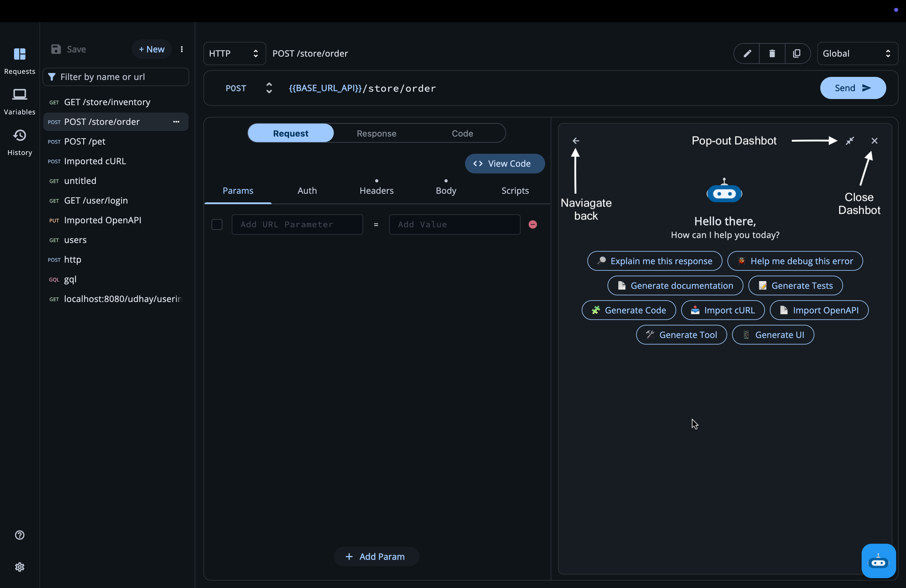
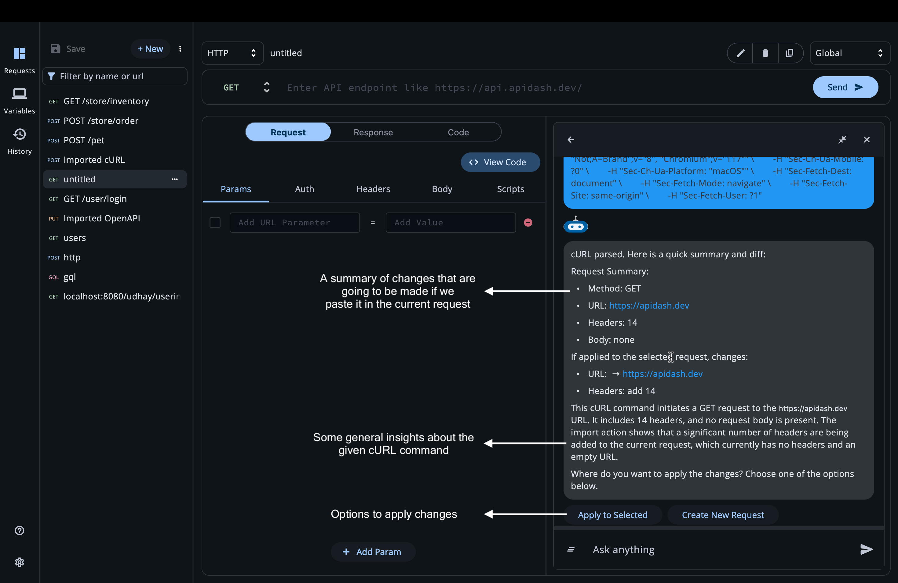
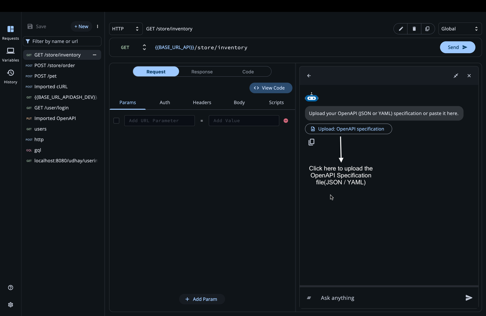
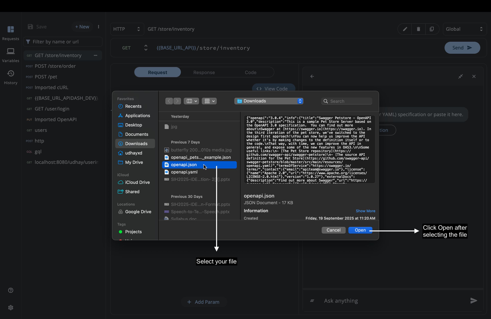
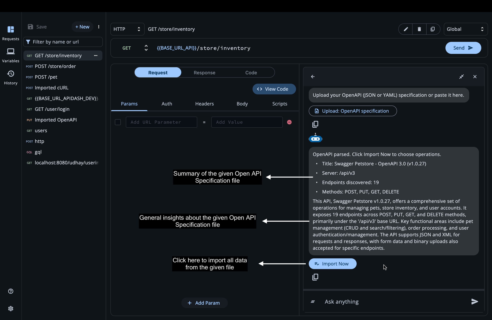
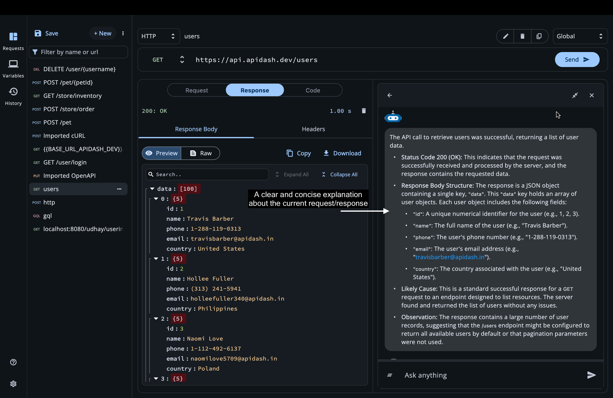
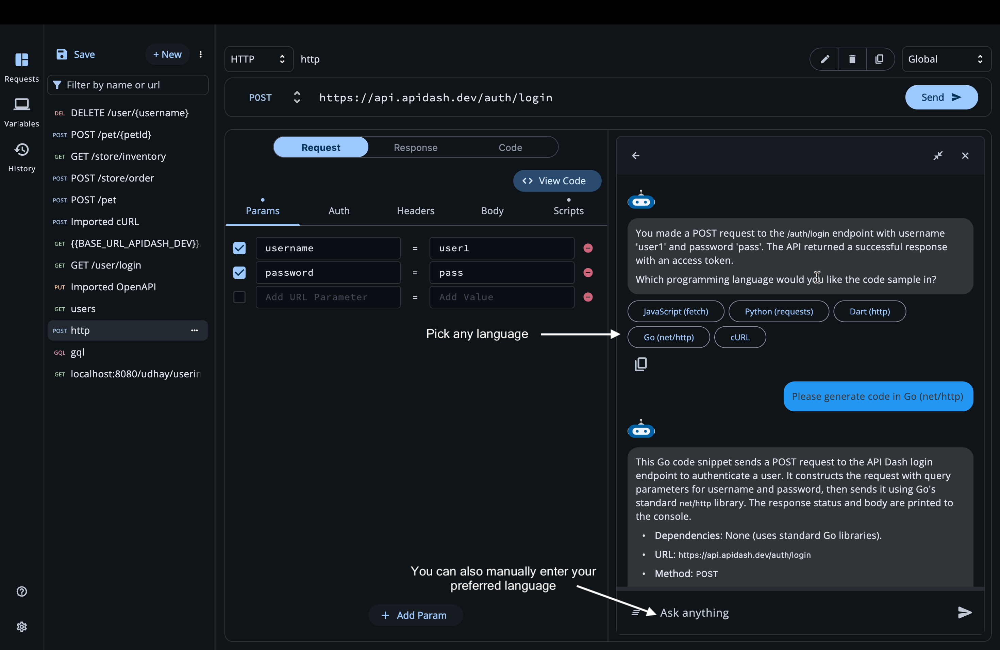
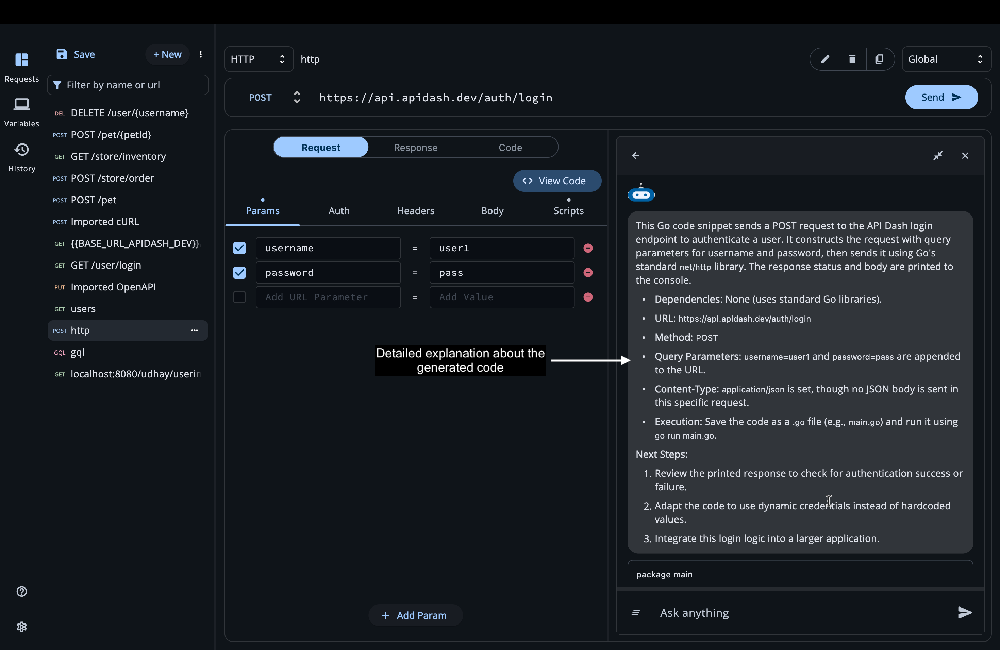

# Dashbot User Guide

Dashbot is your in-app helper for working with APIs inside API Dash. It explains responses, helps fix failing requests, imports cURL/OpenAPI, generates documentation, tests, and runnable code — all without leaving your current request.

## Before You Start
- **Configure an AI model** : Open the AI Request settings and set your preferred provider/model and API key. Dashbot needs this to generate answers. If not configured, you will see a message asking you to set it up.
- **Pick or create a request** : Dashbot works best when a request is selected, especially for Explain, Debug, Tests, Docs, and Code.
- **Network access** : Some features pull insights only from your current request and input. No external API calls are made by Dashbot itself (outside your configured AI provider).

## Open Dashbot
- Floating window: Click the Dashbot button to open it as a floating panel.
  - Move: Drag the colored top bar to reposition.
  - Resize: Drag the small handle at the top-left corner.
  - Pop in/out: Use the “open in new” icon to toggle between the floating window and the in-tab view.
  - Close: Click the Close icon. You can reopen anytime.
- In a tab: Use the Dashbot tab for a docked experience with back and close controls.

## Home Screen Tasks
Dashbot’s home screen lists quick actions:
- Explain response: Explains the last response for the selected request.
- Debug error: Analyzes a failing response and proposes minimal fixes.
- Generate documentation: Creates clean Markdown docs for your request/response and lets you download them.
- Generate tests: Builds simple JavaScript tests; you can add them to the request’s post-request script.
- Generate code: Produces runnable code in common languages.
- Import cURL: Paste a full cURL to recreate a request.
- Import OpenAPI: Upload, paste, or fetch (URL) a spec and import endpoints.

---

## Import cURL
Turn a cURL command into an API Dash request without manual setup.

How it works
1) Choose “Import cURL”.
2) Paste a complete command starting with `curl ...`.
3) Dashbot parses the command and shows:
   - A short summary (method, URL, headers, body type)
   - A diff preview vs your currently selected request (if any)
   - Action buttons:
     - Apply to Selected: Update the currently selected request.
     - Create New Request: Add a new request to your collection.
4) Click an action to apply.

Base URL as environment
- Dashbot detects the base URL and may rewrite your request URL as `{{BASE_URL_<HOST>}}/path`.
- It will create or update a variable in your active Environment (for example `BASE_URL_API_EXAMPLE_COM`).
- See Environment guide for details on editing values.

What’s included from cURL
- Method, full URL
- Headers (including Cookie, User-Agent, Referer; Basic auth from `-u user:pass`)
- Body or form data when present

Known limits
- Some flags do not map to requests (e.g., `-k` insecure SSL, `-L` follow redirects, or very advanced curl options). Review and adjust after import if needed.
- If parsing fails, ensure the command is complete and starts with `curl`.

---

## Import OpenAPI
Import endpoints from an OpenAPI (Swagger) spec to quickly scaffold requests.

Supported input
- JSON or YAML OpenAPI files.
- Public URL to a JSON or YAML OpenAPI document (e.g., `https://api.apidash.dev/openapi.json`).
- Upload via the “Upload Attachment” button (file picker), paste the full spec into the chat box, or enter a URL in the chat field and fetch.

Workflow
1) Choose “Import OpenAPI”.
2) Provide the spec by uploading, pasting, or entering a URL then clicking Fetch.
3) If valid, Dashbot shows a summary plus an “Import Now” button.
4) Click “Import Now” to open the Operation Picker.
5) In the picker:
  - Select All or cherry-pick operations (multi-select).
  - Click Import to add them as new requests.
6) New requests are named like `GET /users`, `POST /items`, etc.

Base URL as environment
- If the spec defines servers, Dashbot will infer the base URL and may rewrite imported URLs to use an environment variable like `{{BASE_URL_<HOST>}}`.

URL fetching notes
- The URL must be publicly reachable and return raw JSON or YAML (not an HTML page).
- Auth-protected or dynamically generated docs pages may fail; download and upload the spec instead.
- Large remote specs may take longer; try file upload if a timeout occurs.

Notes and limits
- Very large specs may take longer and could show only the first N routes for performance.
- Some request body examples or schema-derived form fields may not auto-populate if missing explicit examples.
- “Apply to Selected” is supported when importing a single operation via certain actions, but the Operation Picker’s “Import” creates new requests.
- If URL import fails, verify the URL returns the spec directly and that no authentication is required.

---

## Explain Response
Get a clear, friendly explanation for the selected request.

Use when
- You received a status like 2xx/4xx/5xx and want a quick understanding.

What you get
- Short summary of what happened
- Explanation of the status code in simple terms
- Key details from the response body
- Likely causes or conditions
- Practical next steps

Tips
- The explanation is textual. There are no “Auto Fix” actions in this mode.
- Use the copy icon to copy the response for documentation or sharing.

---

## Debug Error (Auto Fix)
Diagnose a failing request and apply suggested fixes with one click.

Use when
- Your request returns 4xx/5xx or unexpected results.

What you get
- Human-friendly analysis of the problem
- A plan of suggested changes (method/URL/headers/params/body)
- Action buttons (Auto Fix) that apply the change directly

Applying fixes
- Click “Auto Fix” on a suggested change:
  - Update field: URL, method, parameters
  - Headers: add/update/delete
  - Body: replace or set content type
  - Apply cURL/OpenAPI: import payloads to selected or new request
- Changes apply to the currently selected request.

Undo and safety
- Review changes before running again. If you need to revert, use your request history or edit fields manually.
- Dashbot aims for minimal, targeted changes. You control what to apply.

---

## Generate Documentation
Produce clean Markdown docs for your request/response.

How to use
1) Choose “Generate documentation”.
2) Dashbot returns Markdown with:
  - Title and description
  - Request details (method, URL, headers, parameters)
  - Response details and codes
  - Example responses
  - Key takeaways
3) Use an action:
  - Copy: Copies the Markdown to your clipboard.
  - Download Now: Saves a `.md` file to your system Downloads folder (auto-generated filename like `api-documentation.md`).

Notes
- Downloaded file is plain Markdown; move or rename it as needed.
- If a file name collision occurs, a numeric suffix may be appended.

---

## Generate Tests
Create lightweight JavaScript tests for your request.

How it works
1) Choose “Generate Tests”.
2) Dashbot replies with a test plan and a code action.
3) Click “Add Test” to insert the code into the request’s post-request script.
4) Send the request to execute the script after the response.

Where tests go
- Tests are added to the current request’s post-request script area.
- You can modify or remove the script anytime.

Notes and limits
- Tests are self-contained (no external packages). They run with plain JavaScript features.
- Add real credentials or tokens if needed; placeholders are used when values are unknown.

---

## Generate Code
Get runnable code samples for the current request in popular languages.

Workflow
1) Choose “Generate Code”.
2) Select a language from the buttons (JavaScript, Python, Dart, Go, cURL).
3) Dashbot returns a code block. Copy it and run in your environment.

What you get
- Minimal script that sends your request
- Respect for method/URL/headers/params/body
- Basic error handling and printing of status/body
- Notes about any required libraries (with install commands) when applicable

Tips
- Replace placeholders (API keys/tokens) with real values.
- Verify content types and body structures match your API.

---

## Action Buttons Explained
- Apply to Selected: Applies changes to the currently selected request.
- Create New Request: Adds a new request with the suggested setup.
- Import Now (OpenAPI): Opens an operation picker to import endpoints.
- Auto Fix: Applies a specific change (header/url/method/body/params) to the selected request.
- Select Operation: Appears for certain OpenAPI actions to apply a single operation.
- Language buttons: Ask Dashbot to generate code in a specific language.
- Add Test: Appends test code to your post-request script.

---

## Environment Integration
- Base URL variables: Dashbot can auto-create `{{BASE_URL_<HOST>}}` variables in your active environment when importing cURL/OpenAPI.
- Editing values: Open the Environment manager to update base URLs per environment. See the [Environment Variables](./env_user_guide.md) guide.

---

## Capabilities and Limitations
- Focus: Dashbot is focused on API tasks. It will refuse unrelated questions.
- Minimal changes: Auto Fix aims for small, safe edits you approve explicitly.
- Placeholders: When values are unknown, placeholders like `YOUR_API_KEY` are used — replace them.
- cURL flags: Not all flags map 1:1 (e.g., `-k`, `-L`). Review results.
- OpenAPI edge cases: Some specs may omit examples or complex schemas; imports may need manual tweaks.
- Code/tests: Generated snippets are examples. Validate and adapt before production use.

---

## Troubleshooting
- AI model is not configured: Set it in the AI Request settings; then retry.
- cURL parsing failed: Ensure the command starts with `curl` and is complete. Remove shell-specific parts and try again.
- OpenAPI parsing failed (file/paste): Make sure the spec is valid JSON/YAML and complete. Try a smaller spec if huge.
- OpenAPI URL fetch failed: Check that the URL returns raw JSON/YAML (not HTML), is publicly accessible, and does not require authentication; otherwise download and upload the file.
- No actions shown: Some tasks return explanations only. That’s expected for Explain/Docs.
- Changes didn’t apply: Ensure a request is selected and re-run the action. Use “Apply to Selected” vs “Create New Request” appropriately.
- Documentation file not found: Confirm your Downloads folder is writable; retry or use Copy instead.

---

## Frequently Asked Questions
- Does Dashbot send my data elsewhere? It uses the AI provider you configured to generate text. Your requests/responses may be included in prompts. Review your provider’s privacy policy and avoid sharing secrets.
- Can I undo a fix? Use request history or manually revert fields. Consider “Create New Request” to keep the original unchanged.
- Can I mix steps (e.g., import cURL, then debug)? Yes. Dashbot keeps the session per selected request.
